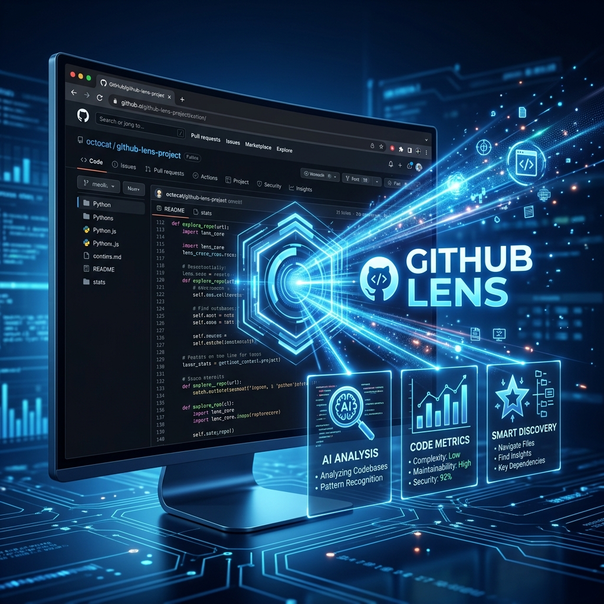

# GitHub Lens 🔍

<p align="right">
  <a href="./README.md">English</a> | <a href="./README.zh-CN.md">简体中文</a>
</p>



> **Intelligent Repository Exploration Powered by AI.**  
> Transform your GitHub browsing experience with instant summaries, technical insights, and smart recommendations.

GitHub Lens is a powerful browser extension that injects AI-driven intelligence directly into the GitHub sidebar. Instead of spending minutes scanning code and READMEs, get a comprehensive overview and technical assessment in seconds.

---

## ✨ Key Features

### 📋 Instant Summaries
- **Core Insight**: Get a 10-word "elevator pitch" for any repository.
- **Tech Stack**: Automatically identify core languages, frameworks, and libraries.
- **Key Highlights**: Summarize the project's unique value propositions and features.

### 🌡️ Project Health & Discovery
- **Activity Assessment**: Real-time evaluation of repository maintenance status.
- **Expert Suggestions**: AI-driven recommendations on whether to adopt or watch a project.
- **Smart Discovery**: Find similar repositories, complementary tools, and in-depth articles.

### ⚙️ Full Customization
- **Multi-Model Support**: Connect with Anthropic (Claude), OpenAI, DeepSeek, Moonshot, and more.
- **Custom Prompts**: Tailor the AI analysis to your specific needs.
- **Language Support**: Seamlessly output results in English or Chinese.

---

## 🚀 Getting Started

### Install from Chrome Web Store
- [Download GitHub Lens](https://chromewebstore.google.com/detail/github-lens/cljkhckgkdgkfklbcclkajiopnejfjbo)

### Prerequisites
- [Node.js](https://nodejs.org/) (v18+)
- [pnpm](https://pnpm.io/) (v8+)

### Installation
1. Clone the repository:
   ```bash
   git clone https://github.com/your-username/github-lens.git
   cd github-lens
   ```

2. Install dependencies:
   ```bash
   pnpm install
   ```

3. Run in development mode:
   ```bash
   pnpm dev
   ```

### Loading the Extension
1. Open Chrome and navigate to `chrome://extensions/`.
2. Enable **Developer mode**.
3. Click **Load unpacked** and select the `build/chrome-mv3-dev` folder generated by Plasmo.

---

## 🛠️ Configuration

1. Open the extension **Options** (right-click the extension icon or click the settings icon in the sidebar).
2. Configure your **API Provider** and enter your **API Key**.
3. Test your connection to ensure everything is set up correctly.
4. Enjoy your new AI-powered GitHub experience!

---

## 📁 Project Structure

```text
.
├── assets/           # Extension icons and static assets
├── background/       # Service workers and background logic
├── components/       # Shadcn UI components and feature views
├── contents/         # Content scripts (GitHub sidebar injection)
├── lib/              # Core logic, AI prompts, and utility functions
├── options/          # Extension settings page
├── popup/            # Extension popup menu
└── styles/           # Global styles and Tailwind configuration
```

---

## 🛡️ Privacy & Security
GitHub Lens communicates directly with your chosen AI provider. Your API Keys are stored securely in your browser's local storage and are never sent to our servers.

---

## 📄 License
[MIT License](LICENSE)

---

<p align="center">
  Made with ❤️ for the Open Source Community.
</p>
